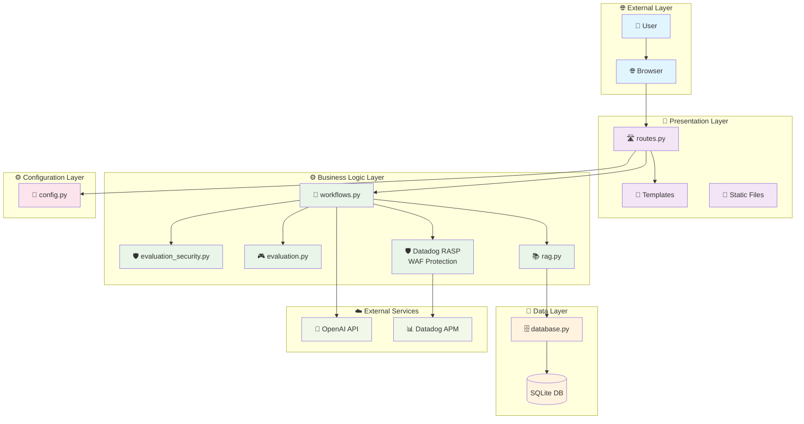
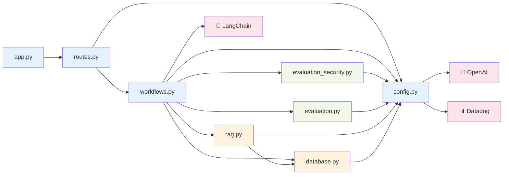
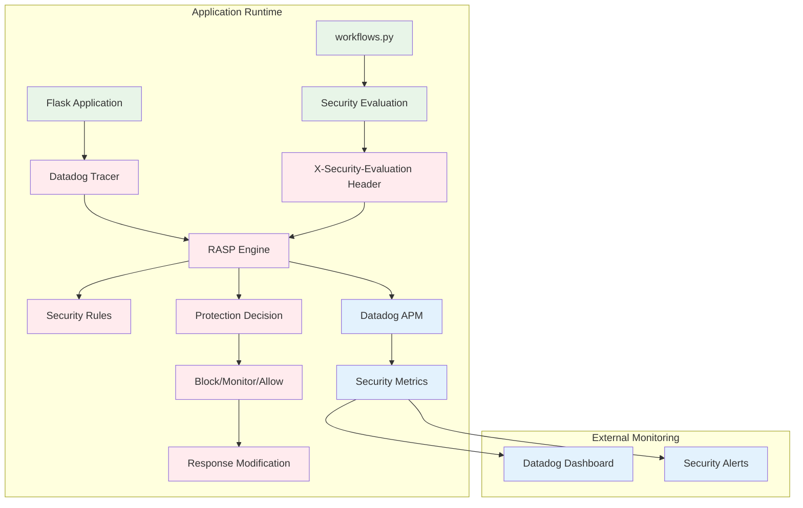
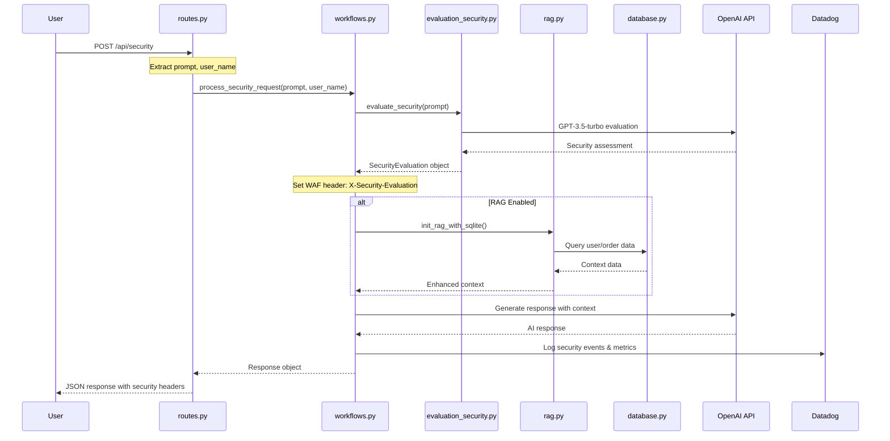
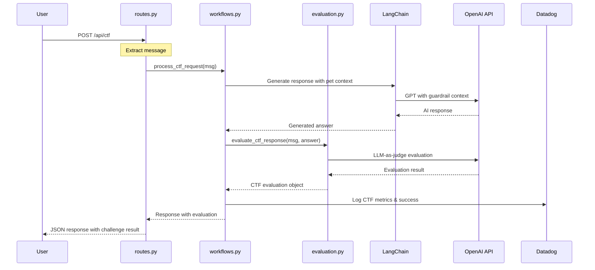
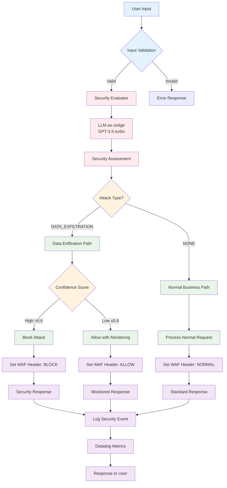
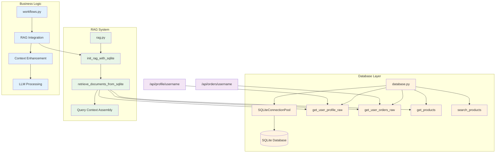
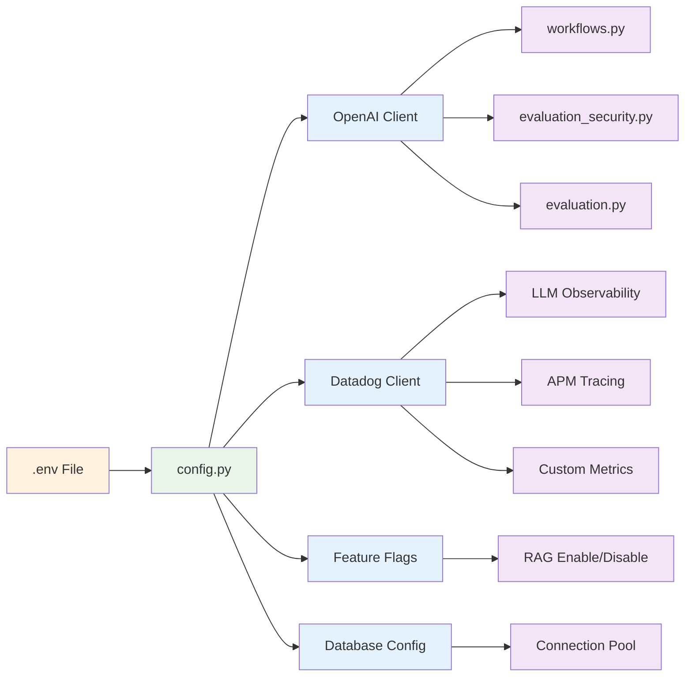

# 🏗️ Application Code Architecture

This document provides comprehensive visualizations and explanations of the TechBot application's code structure, data flow, and component interactions.

## 📋 Table of Contents

1. [High-Level Architecture Overview](#high-level-architecture-overview)
2. [Module Dependency Graph](#module-dependency-graph)
3. [Request Flow Diagrams](#request-flow-diagrams)
4. [Security Evaluation Pipeline](#security-evaluation-pipeline)
5. [Database Integration Flow](#database-integration-flow)
6. [Component Interaction Matrix](#component-interaction-matrix)
7. [Code Organization](#code-organization)

---

## 🎯 High-Level Architecture Overview



---

## 🔗 Module Dependency Graph



---

## 🛡️ RASP (Runtime Application Self-Protection) Integration

**Important**: Datadog WAF is actually a **RASP** (Runtime Application Self-Protection) system that runs within the application tracer, not as an external component.

### RASP Architecture



### Key RASP Benefits vs External WAF

| Aspect | External WAF | Datadog RASP |
|--------|-------------|--------------|
| **Location** | Network perimeter | Inside application runtime |
| **Context** | Limited HTTP data | Full application context |
| **Integration** | Separate configuration | Native application integration |
| **Accuracy** | Higher false positives | Lower false positives with app context |

---

## 🔄 Request Flow Diagrams

### Security API Request Flow (`/api/security`)



### CTF API Request Flow (`/api/ctf`)



---

## 🛡️ Security Evaluation Pipeline



### Security Evaluation Decision Matrix

| bypass_attempt | legitimate_context | Confidence | WAF Action | App Action |
|---|---|---|---|---|
| false | false | High (>0.6) | BLOCK | Block direct attack |
| false | true | High (>0.6) | BLOCK | Block despite context |
| true | false | Medium | ALLOW | Allow sophisticated attack |
| true | true | Low (≤0.6) | ALLOW | Allow with business context |

---

## 💾 Database Integration Flow



---

## 🔄 Component Interaction Matrix

| Component | routes.py | workflows.py | evaluation_security.py | evaluation.py | rag.py | database.py | config.py |
|-----------|-----------|--------------|------------------------|---------------|--------|-------------|-----------|
| **routes.py** | - | ✅ Calls workflows | ❌ No direct call | ❌ No direct call | ❌ No direct call | ✅ Direct DB calls | ✅ Config access |
| **workflows.py** | ❌ Called by routes | - | ✅ Security evaluation | ✅ CTF evaluation | ✅ RAG integration | ✅ DB queries | ✅ Config access |
| **evaluation_security.py** | ❌ No interaction | ✅ Called by workflows | - | ❌ No interaction | ❌ No interaction | ❌ No interaction | ✅ Config access |
| **evaluation.py** | ❌ No interaction | ✅ Called by workflows | ❌ No interaction | - | ❌ No interaction | ❌ No interaction | ✅ Config access |
| **rag.py** | ❌ No interaction | ✅ Called by workflows | ❌ No interaction | ❌ No interaction | - | ✅ DB queries | ✅ Config access |
| **database.py** | ✅ Called by routes | ✅ Called by workflows | ❌ No interaction | ❌ No interaction | ✅ Called by RAG | - | ✅ Config access |
| **config.py** | ✅ Used by routes | ✅ Used by workflows | ✅ Used by security | ✅ Used by CTF | ✅ Used by RAG | ✅ Used by DB | - |

**Legend:**
- ✅ Direct interaction/dependency
- ❌ No direct interaction

---

## 📁 Code Organization

### File Structure & Responsibilities

```
src/
├── 🚪 routes.py              # HTTP endpoints & request handling
│   ├── UI Routes: /, /menu, /ctf, /business
│   ├── API Routes: /api/security, /api/ctf, /api/rag-status
│   ├── Business Routes: /api/profile, /api/orders
│   └── Middleware: Request logging, WAF headers
│
├── ⚙️ workflows.py           # Core business logic orchestration
│   ├── process_security_request() - Main security pipeline
│   ├── process_ctf_request() - CTF challenge processing
│   ├── set_security_evaluation_header() - WAF integration
│   └── build_user_tags() - Datadog tagging
│
├── 🛡️ evaluation_security.py # LLM-as-a-judge security evaluation
│   ├── SecurityEvaluator class
│   ├── SecurityEvaluation dataclass
│   ├── AttackType & AttackSeverity enums
│   └── evaluate_security() - Main evaluation function
│
├── 🎮 evaluation.py          # CTF challenge evaluation
│   ├── CTFJudge class
│   ├── evaluate_ctf_response() - LLM-based CTF evaluation
│   └── Fallback evaluation logic
│
├── 📚 rag.py                 # Retrieval Augmented Generation
│   ├── init_rag_with_sqlite() - RAG system initialization
│   ├── retrieve_documents_from_sqlite() - Context retrieval
│   └── Document search & ranking
│
├── 💾 database.py            # Database operations & connection pooling
│   ├── SQLiteConnectionPool class
│   ├── User profile & order queries
│   ├── Product search functions
│   └── Connection management
│
└── 🔧 config.py              # Configuration & external service clients
    ├── OpenAI client setup
    ├── Datadog configuration
    ├── Feature flags (RAG enabled/disabled)
    └── Environment variable management
```

### Key Design Patterns

#### 1. **Layered Architecture**
- **Presentation Layer**: `routes.py` handles HTTP concerns
- **Business Logic Layer**: `workflows.py` orchestrates business processes
- **Service Layer**: `evaluation_*.py` provide specialized services
- **Data Access Layer**: `database.py` manages data persistence

#### 2. **Dependency Injection**
- Configuration injected through `config.py`
- Database connections managed by connection pool
- External service clients centralized in config

#### 3. **Decorator Pattern**
- `@workflow` decorator for Datadog tracing
- Flask route decorators for HTTP endpoints
- Middleware decorators for request/response processing

#### 4. **Strategy Pattern**
- Different evaluation strategies (security vs CTF)
- Fallback mechanisms for service failures
- Multiple response formats (streaming vs standard)

---

## 🔍 Data Flow Analysis

### Security Request Processing

```mermaid
graph LR
    A[HTTP Request] --> B[Route Handler]
    B --> C[Extract Parameters]
    C --> D[Security Evaluation]
    D --> E[RAG Context Retrieval]
    E --> F[LLM Processing]
    F --> G[Response Assembly]
    G --> H[WAF Header Setting]
    H --> I[Datadog Logging]
    I --> J[HTTP Response]
    
    %% Data transformations
    A -.->|Raw HTTP| B
    B -.->|JSON Data| C
    C -.->|Prompt String| D
    D -.->|SecurityEvaluation| E
    E -.->|Enhanced Context| F
    F -.->|AI Response| G
    G -.->|Response Dict| H
    H -.->|Headers Added| I
    I -.->|Metrics Logged| J
```



### CTF Request Processing

```mermaid
graph LR
    A[HTTP Request] --> B[Route Handler]
    B --> C[Message Extraction]
    C --> D[LangChain Processing]
    D --> E[LLM-as-Judge Evaluation]
    E --> F[Result Assembly]
    F --> G[Datadog Metrics]
    G --> H[HTTP Response]
    
    %% Data transformations
    A -.->|Raw HTTP| B
    B -.->|JSON/Text| C
    C -.->|Message String| D
    D -.->|AI Answer| E
    E -.->|Evaluation Result| F
    F -.->|Structured Response| G
    G -.->|Metrics Logged| H
```



---

## 🎯 Key Architectural Decisions

### 1. **Separation of Concerns**
- **Routes**: Pure HTTP handling, no business logic
- **Workflows**: Business process orchestration
- **Evaluations**: Specialized AI-based assessments
- **Database**: Data access abstraction

### 2. **Security-First Design**
- Every request goes through security evaluation
- WAF headers provide infrastructure-level protection
- Comprehensive logging for security monitoring
- Confidence-based decision making

### 3. **Performance Optimizations**
- Connection pooling for database access
- Caching for common LLM responses
- Async processing where possible
- Minimal external service calls

### 4. **Observability Integration**
- Datadog tracing throughout the application
- Custom metrics for business logic
- Structured logging for debugging
- Security event tracking

### 5. **Extensibility**
- Plugin-based evaluation system
- Configurable RAG backends
- Feature flag support
- Modular component design

---

## ⚙️ Environment Configuration

### Required `.env` File Setup

Create a `.env` file in the project root with the following structure:

```bash
# OpenAI API Key - required for LLM functionality and security evaluation
OPENAI_API_KEY=sk-proj-abc123def456ghi789jkl012mno345pqr678stu901vwx234yz

# Datadog API Keys - required for monitoring, tracing, and WAF integration
DD_API_KEY=a1b2c3d4e5f6g7h8i9j0k1l2m3n4o5p6
DD_APP_KEY=q7r8s9t0u1v2w3x4y5z6a7b8c9d0e1f2g3h4i5j6

# Eppo API Key - optional for feature flag capabilities
EPPO_API_KEY=eppo_live_abc123def456ghi789jkl012mno345

# Application Configuration
FLASK_ENV=production
FLASK_DEBUG=false

# Database Configuration (optional overrides)
DATABASE_URL=sqlite:///techbot.db
DATABASE_POOL_SIZE=20

# Security Configuration (optional)
SECURITY_CONFIDENCE_THRESHOLD=0.6
WAF_HEADER_ENABLED=true
```

### Environment Variable Usage in Code



### Configuration Loading Flow

1. **Application Startup** (`app.py`)
   - Loads environment variables from `.env` file
   - Initializes configuration in `config.py`

2. **Service Initialization** (`config.py`)
   - Creates OpenAI client with API key
   - Sets up Datadog APM and LLM Observability
   - Configures feature flags and database settings

3. **Runtime Access** (All modules)
   - Import configuration from `config.py`
   - Access clients and settings as needed
   - Environment-specific behavior (dev/prod)

⚠️ **Security Note**: Never commit the `.env` file to version control. Add it to `.gitignore`.

---

## 🚀 Recommended Visualization Tools

For different aspects of the codebase, use these visualization approaches:

1. **Overall Architecture**: Mermaid flowcharts (as shown above)
2. **Code Dependencies**: `pydeps` or `import-graph` tools
3. **Database Schema**: Entity-relationship diagrams
4. **API Documentation**: OpenAPI/Swagger specifications
5. **Performance Profiling**: `py-spy` or `cProfile` flame graphs
6. **Security Flow**: Sequence diagrams for attack scenarios

---

## 📚 Further Reading

- [Flask Application Patterns](https://flask.palletsprojects.com/patterns/)
- [Clean Architecture Principles](https://blog.cleancoder.com/uncle-bob/2012/08/13/the-clean-architecture.html)
- [Microservices Patterns](https://microservices.io/patterns/)
- [Security by Design](https://owasp.org/www-project-secure-coding-practices-quick-reference-guide/)

This architecture supports the application's core mission: **demonstrating sophisticated LLM security evaluation with enterprise-grade monitoring and observability**.
